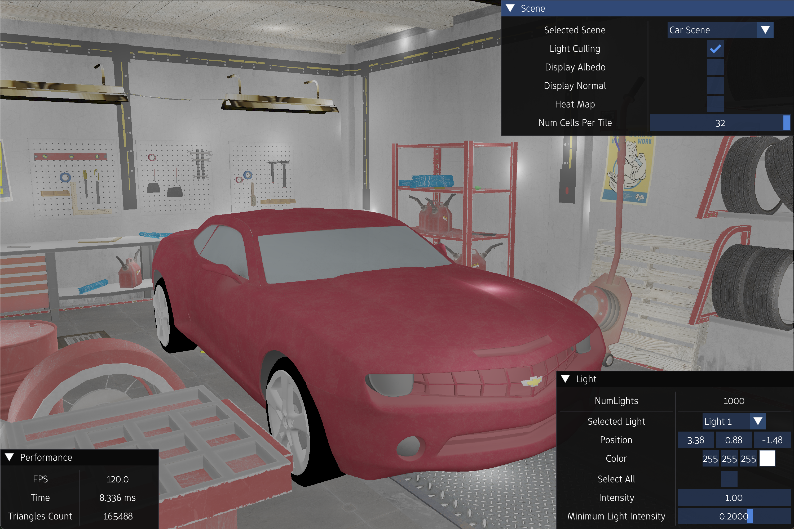
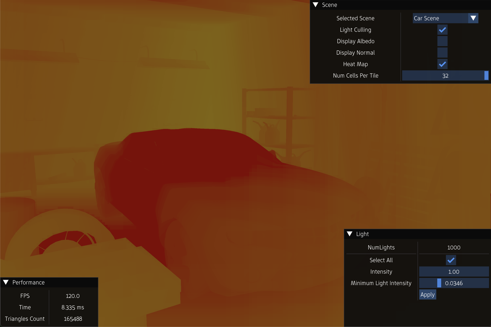
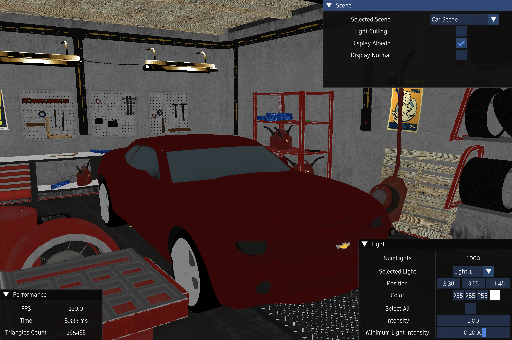
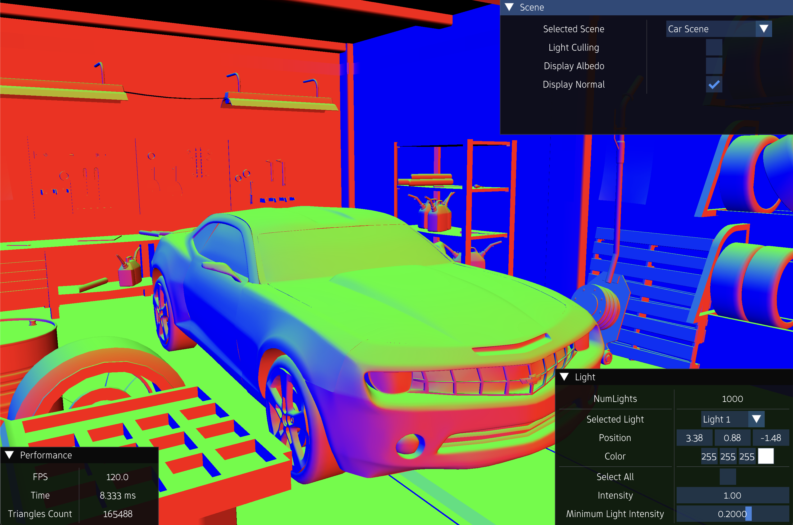
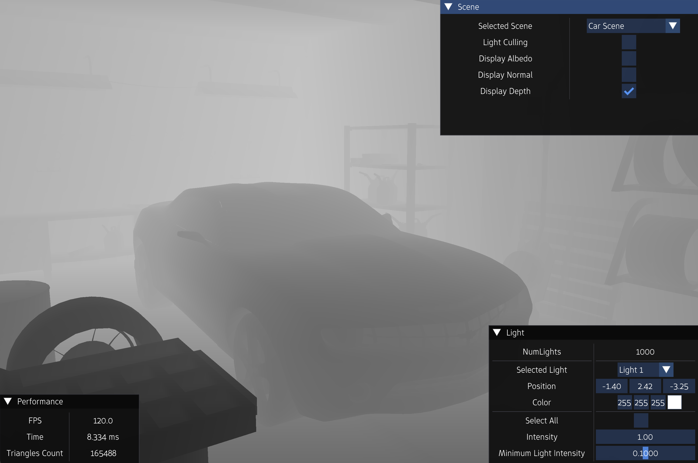

**I wrote a comprehensive blog explaining tiled light culling technique in Vulkan in detail. Read it [here](https://amrhmorsy.github.io/blog/2026/LightCulling/).**

 
 

A real-time minimal demo in <b>C++</b> and <b>Vulkan</b> that demonstrates light culling. It features: 

- A simple shading model that supports lighting
- A simple UI with a performance panel displaying metrics such as FPS, triangles count, and time-per-frame.
- A simple UI for tweaking different parameters. The available parameters are:
  
    - A drop-down list to switch between different scenes
    - The intensity and color of each light source
    - The position of the light source
    - The radius of the bounding sphere of the light source
    - A flag to enable and disable light culling
    - A flag to inspect heat map
    - The number of depth cells per tile
    - A flag to display albedo
    - A flag to display normals

 

  
   
  <em>Scene</em>

 

  
   
  <em>Heat Map</em>

 

  
   
  <em>Albedo</em>

 

  
   
  <em>Normal</em>

 

  
   
  <em>Depth</em>

 

